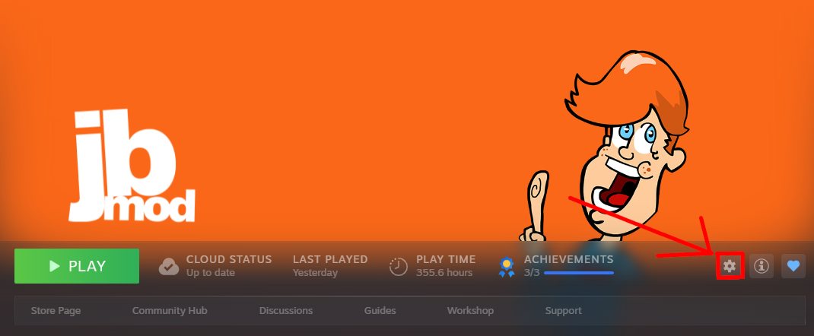
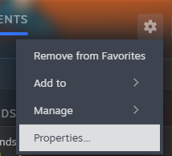
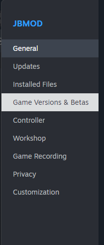
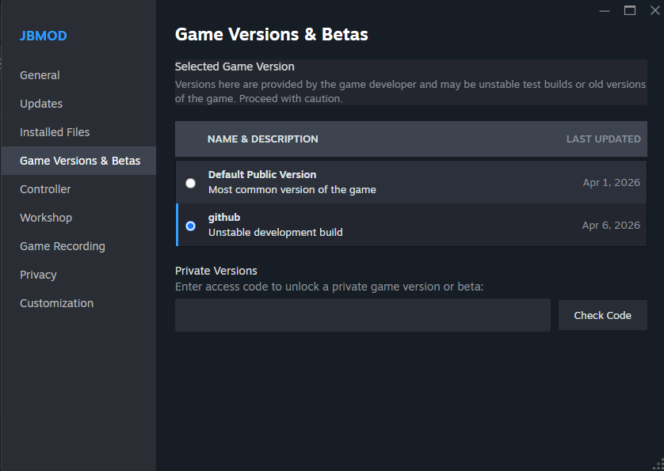

# How to install the GitHub Branch

This wiki was made specifically for this branch of JBMod, so you NEED it to start using it.

The first step to enable the GitHub branch is to go to JBMod in your library, and click on the "Manage" setting.

Once you clicked there you will see a list like this, you are going to click on "Properties"

Now a new window has opened, here you are going to look to the left and select "Game Versions & Betas"

Finally in this tab you are going to see that you have the option "Default Public Version" selected, you are going to select the one below, called "github"

It will automatically update to the new branch, and you are done, you can now start modding with vscript and new features.

